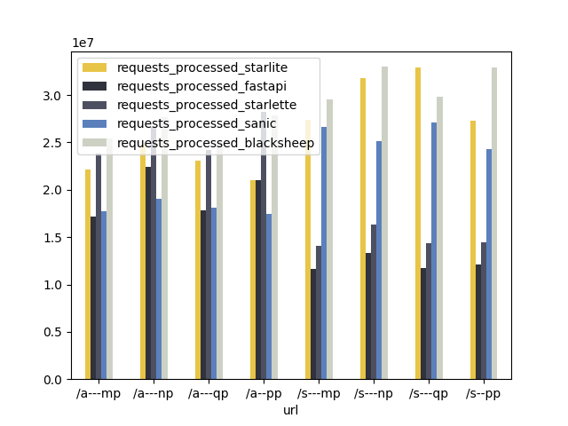
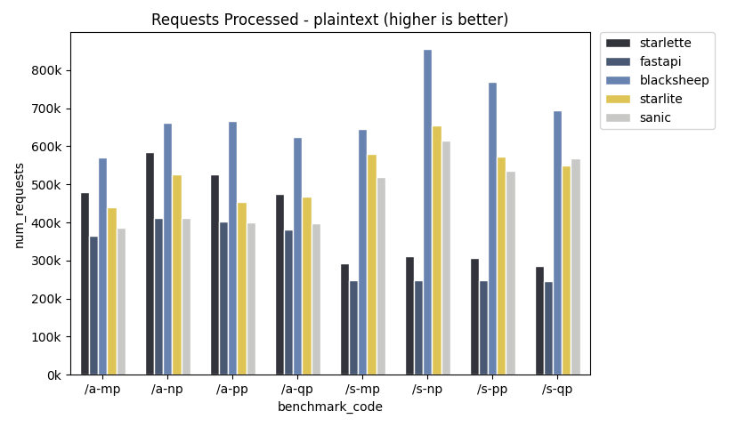

# api-performance-tests

This is an API performance test comparing:

1. [Starlite](https://github.com/starlite-api/starlite)
2. [Starlette](https://github.com/encode/starlette)
3. [FastAPI](https://github.com/tiangolo/fastapi)
4. [Sanic](https://github.com/sanic-org/sanic)
5. [BlackSheep](https://github.com/Neoteroi/BlackSheep)

Using the [autocannon](https://github.com/mcollina/autocannon) stress testing tool.

## Last Run Results

You can few the last run results under the `/results` folder - it contains json files with the output.
The plotting is done using pandas - script is under `/analysis`. PRs improving it are welcome.

### JSON Results

### Plain-Text Results

## Test Setup

Setup is identical for all frameworks.

- The applications are in the folders with their names - `/starlite`, `/starlette`, `/fastapi`, `/scanic`, `/blacksheep`.
- There are no DB querying tests because all frameworks are DB agnostic and as such this has no value in itself.

### Endpoints

There are 8 JSON endpoints:

1. sync endpoint without query or path parameters returning JSON (s-np)
2. async endpoint without query or path parameters returning JSON (a-np)
3. sync endpoint with a query parameter returning JSON (s-qp)
4. async endpoint with a query parameter returning JSON (a-qp)
5. sync endpoint with a path parameter returning JSON (s-pp)
6. async endpoint with a path parameter returning JSON (a-pp)
7. sync endpoint with mixed parameters returning JSON (s-mp)
8. async endpoint with mixed parameters returning JSON (a-mp)

And 8 plain text endpoints:

1. sync endpoint without query or path parameters returning text (s-np)
2. async endpoint without query or path parameters returning text (a-np)
3. sync endpoint with a query parameter returning text (s-qp)
4. async endpoint with a query parameter returning text (a-qp)
5. sync endpoint with a path parameter returning text (s-pp)
6. async endpoint with a path parameter returning text (a-pp)
7. sync endpoint with mixed parameters returning text (s-mp)
8. async endpoint with mixed parameters returning text (a-mp)

Autocannon Settings:
Each endpoint is tested 4x time for 5 seconds each time. Each test run uses 4 workers and 25 connections per worker.

JSON Serialization:
All frameworks use orjson for serialization of the responses. This is meant to ensure that the serialization speed of
orjson is not considered in the benchmarks. It should be noted though that only `starlite` uses orjson by default.

Uvicorn/Gunicorn Settings:
The applications are launched using gunicorn with uvicorn workers - their number depends on the available threads in the
machine. The settings are identical for all applications, you can see it in the `gunicorn.config.py` in each application
folder.

## Executing Tests Locally

To execute the tests:

1. clone the repo
2. make sure to install `curl`
3. run `./test.sh`

The test.sh script will create a virtual environment and install the dependencies for you using poetry.

**Notes**:

- the repository is set to use python 3.10+ so make sure to have it available in your environment.
- if poetry is not installed on your system, it will be installed by the script.

## Updating Dependencies

To update the dependencies simply run `poetry update` - this command is run as part of the test script as well.

## Contributing

Please make sure to install [pre-commit](https://pre-commit.com/) on your system, and then execute `pre-commit install`
in the repository root - this will ensure the pre-commit hooks are in place.

After doing this, add a PR with your changes and a clear description of the changes.
